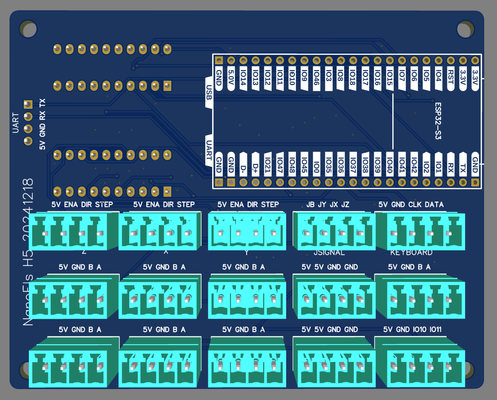
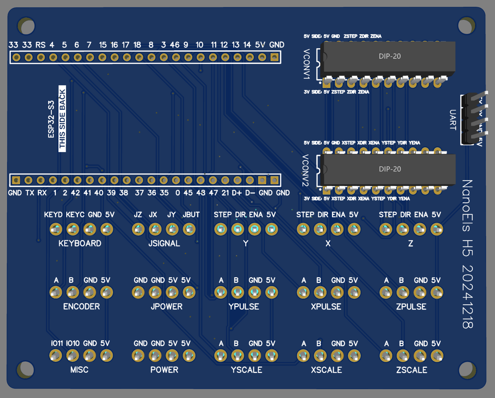

# NanoEls H5

Latest version of the electronic lead screw controller for metal lathes.

## Parts list

- 89€ Nextion 5 inch display [NX8048P050 011C Y](https://www.aliexpress.com/item/1005002457232503.html)
- 23€ [PS2 mini keyboard](https://www.amazon.de/gp/product/B01MRJQVZP)
- 10€ [5V 2A non-USB power adapter](https://www.amazon.de/dp/B09KNFD38L)
- 5€ [ESP32-S3 N16R8 weld](https://www.aliexpress.com/item/1005005051294262.html)
- 3€ [SN74HCT245N](https://www.aliexpress.com/item/1005007118898020.html) - pack of 10, we only need 2
- 6€ 3 packs of [5 pairs 3.5mm terminals 4P straight](https://www.aliexpress.com/item/1005006895741900.html)
- 4€ [USB C male to female](https://www.aliexpress.com/item/1005007549815957.html)
- 5€ [custom PCB](pcb/Gerber_PCB_NanoElsH5-20241218.zip) ordered on jlcpcb.com
- [3D-printed case](case/h5case.step)
- 5x M3 bolts 5-8mm length
- Optional curved 4-pin header to connect display wires to the PCB

## PCB

