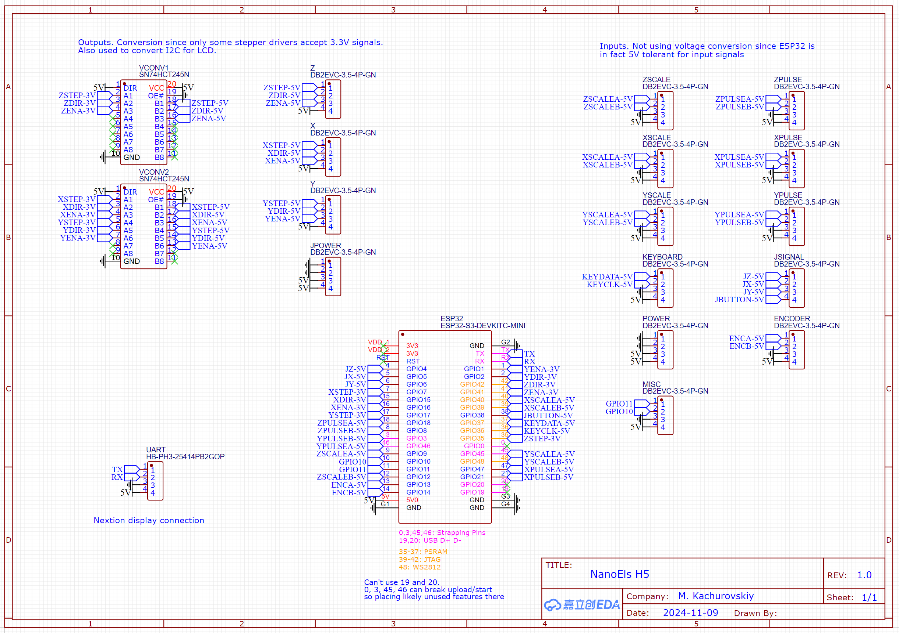

# NanoEls H5

Latest version of the electronic lead screw controller for metal lathes.

## Parts list

- 89€ Nextion 5 inch display [NX8048P050 011C Y](https://www.aliexpress.com/item/1005002457232503.html)
- 23€ [PS2 mini keyboard](https://www.amazon.de/gp/product/B01MRJQVZP)
- 10€ [5V 2A non-USB power adapter](https://www.amazon.de/dp/B09KNFD38L)
- 5€ [ESP32-S3 N16R8 weld](https://www.aliexpress.com/item/1005005051294262.html)
- 3€ [SN74HCT245N](https://www.aliexpress.com/item/1005007118898020.html) - pack of 10, we only need 2
- 6€ 3 packs of [5 pairs 3.5mm terminals 4P straight](https://www.aliexpress.com/item/1005006895741900.html)
- 4€ [USB C male to female](https://www.aliexpress.com/item/1005007549815957.html)
- 5€ [custom PCB](pcb/Gerber_PCB_NanoElsH5-20241218.zip) ordered on jlcpcb.com
- [3D-printed case](case/h5case.step)
- 5x M3 bolts 5-8mm length
- Optional curved 4-pin header to connect display wires to the PCB

## Display options

You can use any other Nextion display model including cheaper and smaller ones without touch.

- Requires re-compiling the `h5.tft` file from the [h5.HMI](https://github.com/kachurovskiy/nanoels/blob/main/h5/screen/h5.HMI) for your display
- Needs custom 3D-printed case since `case/h5case.step` will no longer fit

## Ordering PCB

1. Go to https://cart.jlcpcb.com/quote, click "Add gerber file"
2. Use Gerber ZIP file supplied in https://github.com/kachurovskiy/nanoels/tree/main/h5/pcb/
3. Select `LeadFree HASL` and `Global Standard Direct Line` shipping
4. Should cost 5€ and arrive within 2 weeks

## Schematics and PCB component placement

## Assembly instructions

NOTE: throughout the assembly make sure to avoid static electricity accumulation on your body by wearing suitable clothes and shoes, not using chairs known to cause ESD. Touch any grounded metal device housing to check.

1. Check that ESP32 board is working by uploading [h5.ino](h5.ino) onto it using Arduino IDE. See `Programming the controller` section below for more info.
2. Solder ESP32, 2x SN74HCT245N and optional curved 4-pin header onto the PCB. **Triple check the side and orientation of each piece before soldering.**
3. Insert USB extension into the COM port
4. Separate all terminals into 2 pieces. Insert female terminals into the 3D-printed housing. Place the PCB on top and secure it with 4 M3 bolts. Secure the other end of the USB cable in the access hole with an M3 bolt.
5. Solder 15 terminals to the PCB while everything is positioned in the case.
6. Remove screen back cover. Attach the included 4-lead wire to the screen and to the PCB - each `RX` should be attached to `TX` on the other side.
7. Bolt the case and screen together using the bolts that used to hold the back cover.
8. Use empty MicroSD card 32 GB or smaller formatted as FAT32. Copy [h5.tft](screen/h5.tft) to the card, insert into the screen. Connect 5V power supply to the POWER terminal, wait for screen to report that flashing has finished. Disconnect the power, remove the card.
9. Cut the keyboard cord to the suitable length, find which color corresponds to which line in your particular keyboard [using the port pinout](https://en.wikipedia.org/wiki/PS/2_port) and multimeter continuity tester.
10. Supply up to 2A of power to the `POWER` terminal. You can flash the ESP32 via the USB but 0.5A provided by standard USB is not enough to start the screen.

## Rear label

Print [h5.pdf](case/h5.pdf) on a normal printer as A4 at 19% scale, cut out and glue to the back of the case using e.g. double-sided tape.

If you want, you can modify the label by editing [h5.fig](case/h5.fig) file on figma.com and export a new PDF for printing.

## Wiring

ENCODER terminal:

- 5V - connect to encoder power-in line (usually red)
- GND - connect to encoder power-in line (usually black) and wire shielding if there's any
- ENCB - connect to one of the encoder signal lines
- ENCA - connect to one of the encoder signal lines

Z and X axes - stepper terminal for the lead screws:

- 5V - connect to stepper driver PUL+, DIR+, ENA+ and wire shielding if there's any
- ENA - connect to stepper driver ENA-
- DIR - connect to stepper driver DIR-
- STEP - connect to stepper driver PUL-

Pulse motion wheels for Z and X axes (`ZPULSE`, `XPULSE`) are wired in the same manner as the encoder. For any encoder terminal, switch `A` and `B` wires to invert the encoder direction.

Scale and joystick terminals aren't used in the code yet.

## Programming the controller

- Install the [Arduino IDE](https://docs.arduino.cc/software/ide-v2)
- Add `https://raw.githubusercontent.com/espressif/arduino-esp32/gh-pages/package_esp32_index.json` in [Preferences as "Additional board manager URLs"](https://github.com/kachurovskiy/nanoels/assets/517919/dcc023e6-20fc-4284-ba56-d466dbe4ce53)
- Install `esp32` [via Board Manager](https://github.com/kachurovskiy/nanoels/assets/517919/094d00ff-1e51-4f26-bb81-aa4ad42bde2a)
- Install `PS2KeyAdvanced` and `WebSockets` via Arduino IDE Library Manager
- Download [this repository](https://github.com/kachurovskiy/nanoels/archive/refs/heads/main.zip), unzip, go to `h5` directory and open `h5.ino` file in the Arduino IDE
- Check the top constants (e.g. encoder steps, motor steps, display offset) and adjust if needed
- Select "ESP32S3 Dev Module" as device at the top, pick COM port that appears when you connect the device with a USB cable
- Upload the sketch to your H5 controller

A few things to check after upload:

- Spindle direction: show angle on screen using `Win` button on your keyboard. Rotate the chuck forward manually - angle should increase. If it decreases, swap `B` and `A` wires in the terminal
- Motor direction: try moving motors using keyboard arrows - if motor is moving in the wrong direction, change `INVERT_Z` or `INVERT_X` in the code, re-upload the sketch (or swap the motor leads `A+` and `A-` in the stepper driver if it's open loop)

Troubleshooting:

- Arduino IDE doesn't detect NanoEls H5: try a different USB cable
- Arduino IDE fails to upload the sketch: make sure you plugged the extension into the `COM` port, **not** the `USB` port on the ESP32
- Not sure which COM port is NanoEls H5: unplug it, check the list of available ports in Arduino IDE, plug H5 in, see new port that appeared is H5
- `ImportError: No module named serial` error on Linux: try `sudo apt install python3-serial`

## Mounting options

On the back of the case there are 2 holes for M5 threaded inserts 130mm on center.

## Usage manual

It's early days for H5. For now it works the same as H4, [please read H4 manual if you've never used it](https://github.com/kachurovskiy/nanoels/blob/main/h4/README.md#usage-manual) - H4 keys correspond to the following keyboard keys:

- Left, up, down, right arrows control the manual movement
- Plus / minus control the pitch
- Enter turns on the current mode
- Esc is stop
- A W D S control limits
- Win controls angle / rpm display / WiFi status
- Tilda / backtick (key under ESC) controls step
- M changes metric / inch / tpi
- R for reverse
- Top row numbers 0-9 work as number input
- Backspace removes last number
- Modes:
  - F1: gearbox
  - F2: turning
  - F3: facing
  - F4: cone
  - F5: parting
  - F6: threading
  - F7: async
  - F8: ellipse
  - F9: gcode
  - F10: y axis (if configured)
- X zeroes X axis
- Z zeroes Z axis
- C disables / enables X axis
- Q disables / enables Z axis
- O pressed while a number is entered zeroes X from diameter (on H4 this was on `A`)

## GCode over WiFi for complex parts

Specify your WiFi network name and password in https://github.com/kachurovskiy/nanoels/blob/main/h5/h5.ino#L43-L44 and use Win keyboard key to see the IP address NanoEls connected on. Enter that address in the browser to see the Web UI. It can be used to save GCode files onto controller and run them later at the machine in the GCODE mode.

To generate GCode for your parts, upload STL model of your part to https://kachurovskiy.com/lathecode/ and specify parameters like stock diameter and tool used.

## Custom keyboard mapping

Use [`#define B_...`](https://github.com/kachurovskiy/nanoels/blob/main/h5/h5.ino#L121) constants to adjust key mapping, uncomment [a line](https://github.com/kachurovskiy/nanoels/blob/main/h5/h5.ino#L2640) in `void processKeypadEvent()` function to see on Nextion which key code your keyboard sends for any given key.
